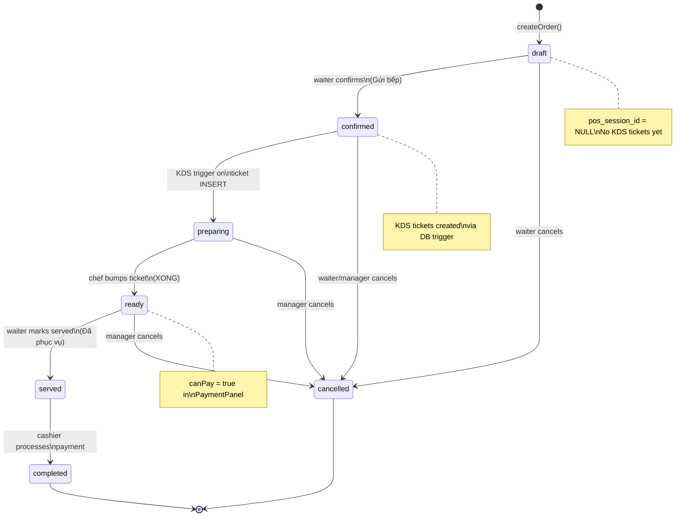
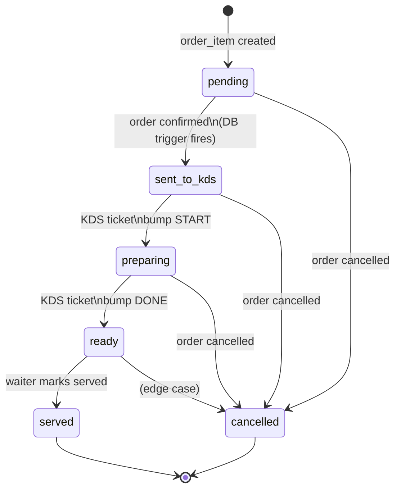
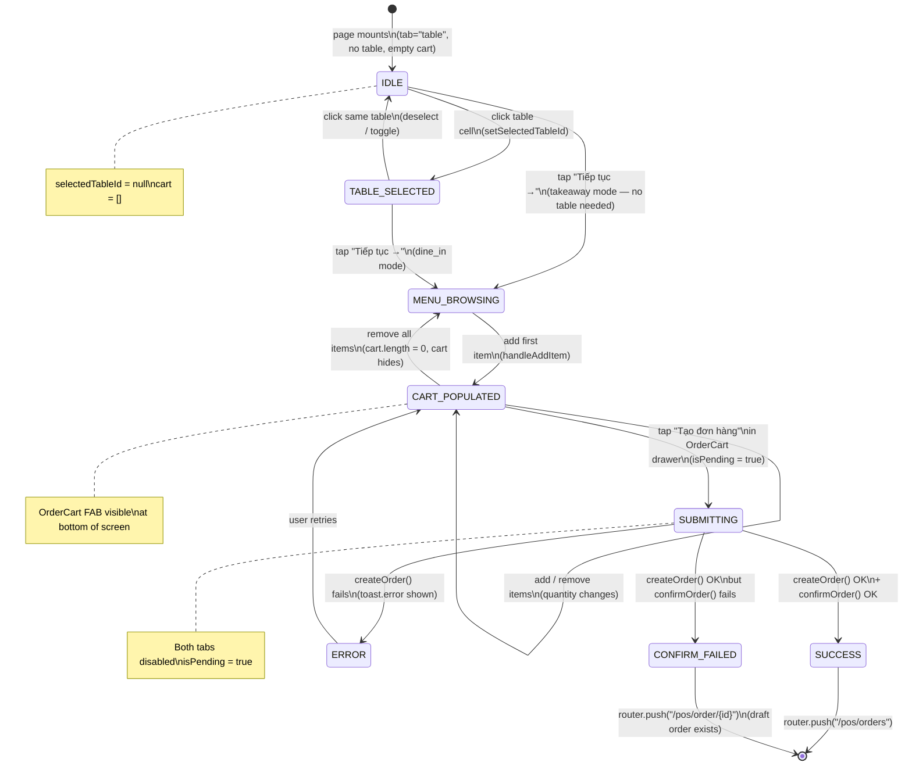
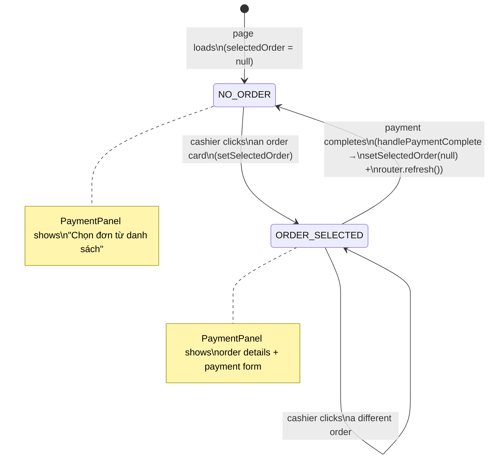
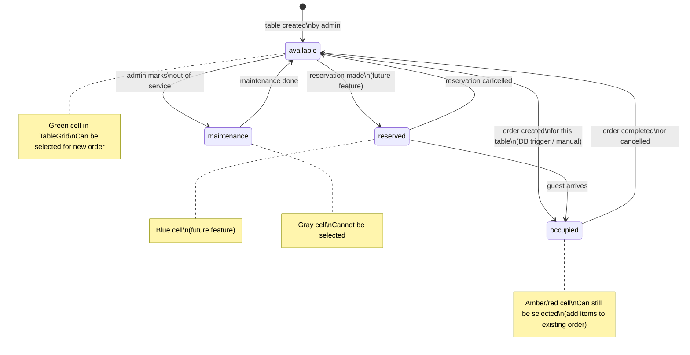
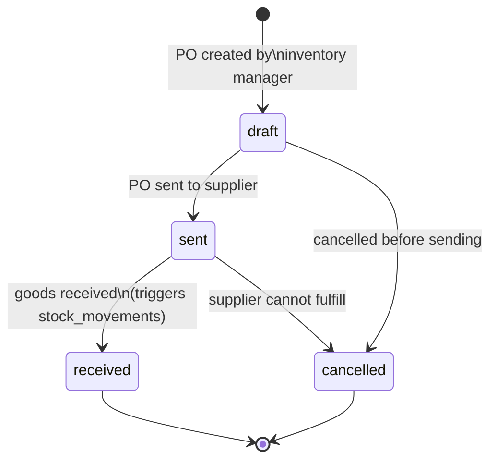
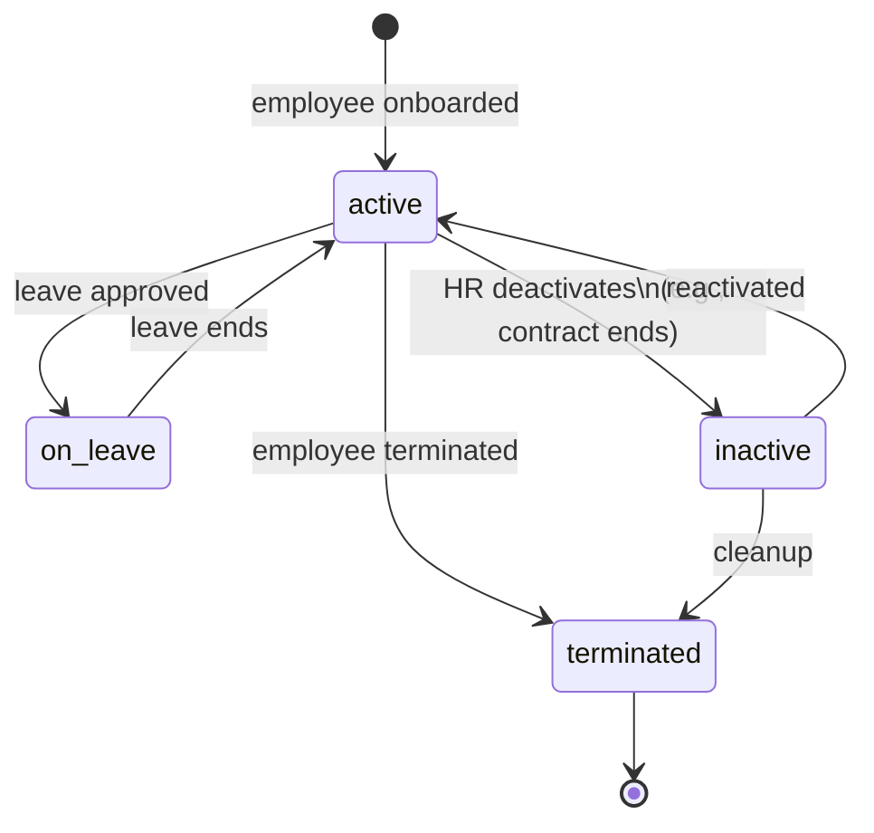
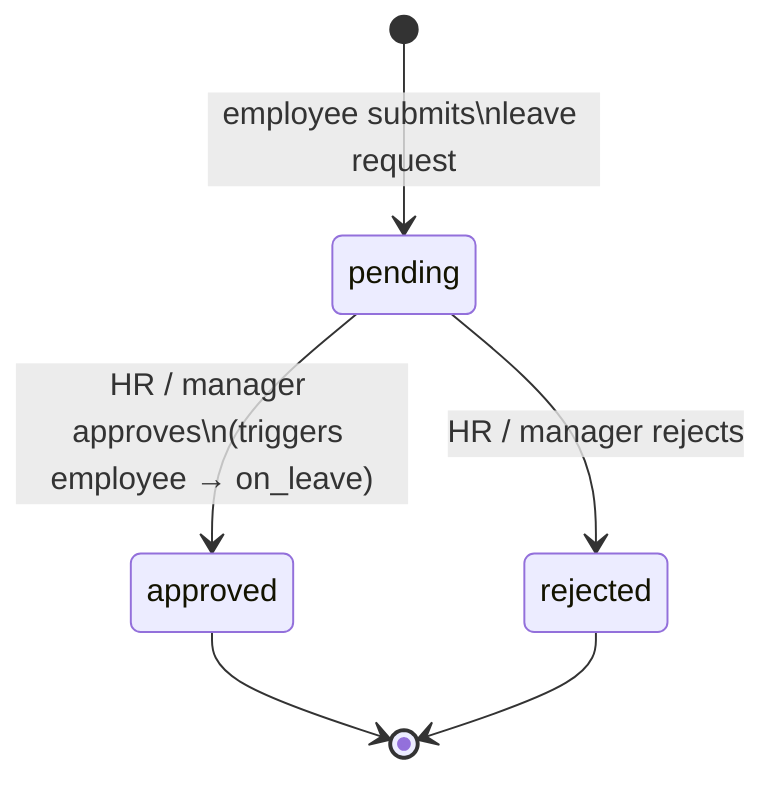
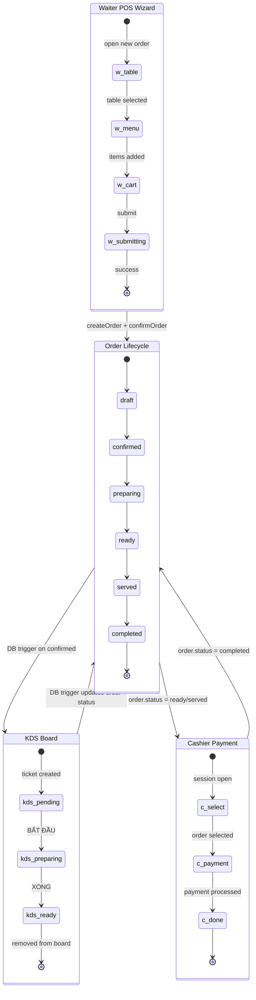

# State Machine Diagrams

Auto-generated from source code analysis. Each diagram maps directly to component logic and constants.

---

## 1. Order Lifecycle

**Source:** `packages/shared/src/constants.ts` → `VALID_ORDER_TRANSITIONS`
**Who drives it:** Waiter (draft→confirmed), KDS DB trigger (confirmed→preparing→ready), Waiter (ready→served), Cashier (served→completed)



---

## 2. Order Item Lifecycle

**Source:** `packages/shared/src/constants.ts` → `ORDER_ITEM_STATUSES`
**Who drives it:** DB trigger `create_kds_tickets` on order confirm, KDS bump propagates back via `update_order_from_kds` trigger



---

## 3. KDS Ticket Lifecycle

**Source:** `packages/shared/src/constants.ts` → `VALID_KDS_TRANSITIONS`, `ticket-card.tsx` → `handleBump()`

```mermaid
stateDiagram-v2
    [*] --> pending : DB trigger creates ticket\non order confirm

    pending --> preparing : chef taps BẮT ĐẦU\n(bumpTicket → "preparing")

    preparing --> ready : chef taps XONG\n(bumpTicket → "ready")

    ready --> [*] : ticket removed from board\n(useKdsRealtime filters out)

    note right of pending : Blue button "BẮT ĐẦU"\nTiming: GREEN border
    note right of preparing : Green button "XONG"\nTiming escalates over time
    note right of ready : Triggers order item\nstatus update via DB trigger
```

---

## 4. KDS Ticket Timing Display

**Source:** `ticket-card.tsx` → `getTimingColor()`, timer `useEffect` (10s interval)
This is a derived display state overlaid on ticket status — not a separate entity.

```mermaid
stateDiagram-v2
    [*] --> NORMAL : ticket created\n(elapsed = 0)

    NORMAL --> WARNING : elapsed >= warning_min\n(default: timingRule.warning_min)
    NORMAL --> CRITICAL : elapsed >= critical_min\n(skip WARNING if jump is large)

    WARNING --> CRITICAL : elapsed >= critical_min

    CRITICAL --> [*] : ticket bumped to ready\n(removed from board)
    WARNING --> [*] : ticket bumped to ready
    NORMAL --> [*] : ticket bumped to ready

    note right of NORMAL : border-green-500\nbg-green-950\ntimer text: green
    note right of WARNING : border-yellow-500\nbg-yellow-950\ntimer text: yellow
    note right of CRITICAL : border-red-500\nbg-red-950\ntimer text: red
```

---

## 5. useKdsRealtime — Subscription State

**Source:** `use-kds-realtime.ts`
Manages the live ticket list via Supabase `postgres_changes` on `kds_tickets` table.

```mermaid
stateDiagram-v2
    [*] --> INITIALISED : hook mounts\n(initialTickets from SSR)

    INITIALISED --> SUBSCRIBED : supabase.channel().subscribe()

    SUBSCRIBED --> SUBSCRIBED : heartbeat / no change

    SUBSCRIBED --> TICKET_ADDED : INSERT event\n(status = pending OR preparing\nAND station_id matches)

    SUBSCRIBED --> TICKET_REMOVED : UPDATE event\n(status = ready OR cancelled)

    SUBSCRIBED --> TICKET_UPDATED : UPDATE event\n(status = pending OR preparing)

    SUBSCRIBED --> TICKET_DELETED : DELETE event

    TICKET_ADDED --> SUBSCRIBED : setTickets([...prev, newTicket])
    TICKET_REMOVED --> SUBSCRIBED : setTickets(prev.filter(t ≠ id))
    TICKET_UPDATED --> SUBSCRIBED : setTickets(prev.map update)
    TICKET_DELETED --> SUBSCRIBED : setTickets(prev.filter(t ≠ id))

    SUBSCRIBED --> [*] : component unmounts\n(removeChannel)

    note right of SUBSCRIBED : Channel: kds-station-{stationId}\nFilter: station_id=eq.{stationId}
```

---

## 6. Waiter POS — New Order Wizard

**Source:** `new-order-client.tsx`
The two-tab wizard that orchestrates table selection, menu browsing, cart, and order submission.



---

## 7. OrderCart Drawer

**Source:** `order-cart.tsx`
A floating action button + bottom drawer. Rendered only when cart is non-empty.

```mermaid
stateDiagram-v2
    [*] --> HIDDEN : cart.length === 0\n(component returns null)

    HIDDEN --> FAB_VISIBLE : first item added\n(cart.length > 0)

    FAB_VISIBLE --> DRAWER_OPEN : tap FAB button\n(Drawer trigger)
    FAB_VISIBLE --> HIDDEN : all items removed\n(cart cleared)

    DRAWER_OPEN --> FAB_VISIBLE : tap "Tiếp tục chọn món"\n(DrawerClose)
    DRAWER_OPEN --> FAB_VISIBLE : swipe down / backdrop click

    DRAWER_OPEN --> DRAWER_OPEN : tap + / −\n(quantity adjustment)
    DRAWER_OPEN --> FAB_VISIBLE : last item removed\n(returns null → hidden)

    DRAWER_OPEN --> SUBMITTING : tap "Tạo đơn hàng"\n(isPending = true)

    SUBMITTING --> DRAWER_OPEN : server returns error\n(handled by parent)
    SUBMITTING --> [*] : server returns success\n(parent navigates away)

    note right of FAB_VISIBLE : Shows: {n} món · {subtotal}\nfixed bottom-16
    note right of SUBMITTING : Button shows "Đang tạo đơn..."\nAll buttons disabled
```

---

## 8. Cashier Station

**Source:** `cashier-client.tsx`, `payment-panel.tsx`



---

## 9. PaymentPanel

**Source:** `payment-panel.tsx`
The right-side panel of the cashier station.

```mermaid
stateDiagram-v2
    [*] --> NO_ORDER : order prop = null

    NO_ORDER --> ORDER_LOADED : order prop provided

    ORDER_LOADED --> NOT_PAYABLE : order.status NOT IN\n(ready, served, confirmed, preparing)

    ORDER_LOADED --> AWAITING_AMOUNT : order.status IN\n(ready, served, confirmed, preparing)\n→ canPay = true

    NOT_PAYABLE --> [*] : shows warning banner\n"Đơn chưa sẵn sàng thanh toán"

    AWAITING_AMOUNT --> AMOUNT_INSUFFICIENT : amountTendered entered\nbut < order.total\n(change = null, button disabled)

    AWAITING_AMOUNT --> AMOUNT_SUFFICIENT : amountTendered >= order.total\n(change calculated and shown)

    AMOUNT_INSUFFICIENT --> AMOUNT_SUFFICIENT : user increases amount\nor taps quick-amount button

    AMOUNT_SUFFICIENT --> AMOUNT_INSUFFICIENT : user decreases amount\nbelow order.total

    AMOUNT_SUFFICIENT --> PROCESSING : tap "Thanh toán"\n(isPending = true)

    PROCESSING --> COMPLETE : processPayment() success\n(toast: tiền thừa shown)

    PROCESSING --> AMOUNT_SUFFICIENT : processPayment() error\n(toast.error, stays in panel)

    COMPLETE --> [*] : setAmountTendered("")\nonPaymentComplete() called

    note right of AWAITING_AMOUNT : Quick-amount buttons shown\n(exact, round 10K/50K/100K)
    note right of AMOUNT_SUFFICIENT : Green "Tiền thừa" box visible
    note right of PROCESSING : Button: "Đang xử lý..."\nAll inputs disabled
```

---

## 10. POS Session (Shift)

**Source:** `session-form.tsx` → `OpenSessionForm` + `ActiveSessionCard`
**Source:** `packages/shared/src/constants.ts` → `SESSION_STATUSES`

```mermaid
stateDiagram-v2
    [*] --> NO_SESSION : page loads\n(no active session found)

    NO_SESSION --> OPENING : submit OpenSessionForm\n(isPending = true)
    OPENING --> NO_SESSION : openSession() error\n(error message shown)
    OPENING --> ACTIVE : openSession() success\n(page re-renders with\nActiveSessionCard)

    ACTIVE --> CLOSE_DIALOG : tap "Đóng ca"\n(AlertDialog opens)

    CLOSE_DIALOG --> ACTIVE : tap "Hủy"\n(dialog dismissed)

    CLOSE_DIALOG --> CLOSING : enter closing_amount\n+ tap "Xác nhận đóng ca"\n(isPending = true)

    CLOSING --> CLOSE_DIALOG : closeSession() error\n(error shown inside dialog)
    CLOSING --> NO_SESSION : closeSession() success\n(session.status = closed\npage re-renders)

    note right of NO_SESSION : OpenSessionForm shown\nSelect terminal + opening amount
    note right of ACTIVE : Elapsed timer ticking (1 min)\nShows: cash total, tx count\nExpected drawer amount
    note right of CLOSE_DIALOG : Shows expected vs actual\nDifference calculated live
    note right of CLOSING : Button: "Đang đóng..."\nInputs disabled
```

---

## 11. Table Status

**Source:** `packages/shared/src/constants.ts` → `TABLE_STATUSES`
**Displayed in:** `table-selector.tsx` (color-coded cells in TableGrid)



---

## 12. POS Terminal Registration

**Source:** `packages/shared/src/constants.ts` → `TERMINAL_TYPES`, admin terminals actions
**Managed in:** `admin/terminals/actions.ts`

```mermaid
stateDiagram-v2
    [*] --> PENDING_APPROVAL : terminal registered\n(type: mobile_order OR cashier_station)

    PENDING_APPROVAL --> APPROVED : admin approves\n(status = active)
    PENDING_APPROVAL --> DELETED : admin deletes

    APPROVED --> REVOKED : admin revokes\n(status = inactive)
    REVOKED --> APPROVED : admin re-approves

    APPROVED --> DELETED : admin deletes
    REVOKED --> DELETED : admin deletes

    DELETED --> [*]

    note right of PENDING_APPROVAL : Cannot process orders\nor open sessions
    note right of APPROVED : mobile_order: can create orders\ncashier_station: can open sessions\n+ process payments
    note right of REVOKED : Device blocked\nCannot log in to POS
```

---

## 13. Purchase Order Lifecycle (Planned — Week 5-6)

**Source:** `packages/shared/src/constants.ts` → `VALID_PO_TRANSITIONS`
Not yet implemented in UI — schema + constants are ready.



---

## 14. Employee Status (Planned — Week 5-6)

**Source:** `packages/shared/src/constants.ts` → `EMPLOYEE_STATUSES`
Not yet implemented in UI — constants are ready.



---

## 15. Leave Request (Planned — Week 5-6)

**Source:** `packages/shared/src/constants.ts` → `LEAVE_STATUSES`



---

## Cross-Component Flow: Full Order Journey

End-to-end sequence showing how all state machines interact for a dine-in order.


